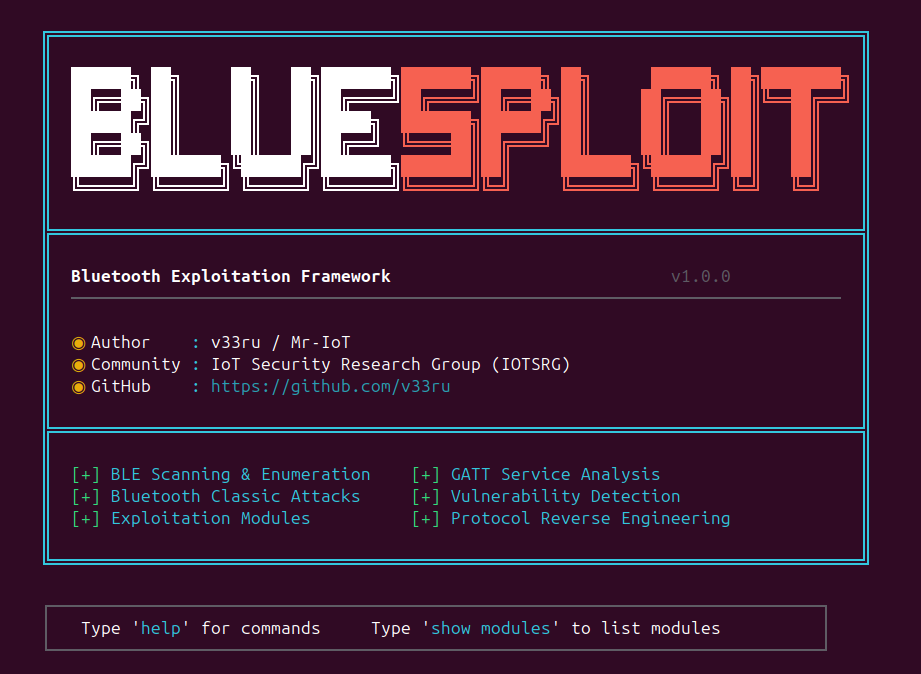

# Introduction

!!! warning "Project status, scaffold, not battle-tested"
    BlueSploit is currently a **scaffold-quality framework**. Most modules
    are CVE-aware probes / fingerprint matchers, not fully working
    end-to-end exploits. A small number (Marc Newlin's keystroke-injection
    family, the recon/DoS/post-ex set, `csrk_signed_write`,
    `smp_keysize_downgrade`, the tool wrappers) are genuinely functional
    today.

    I, **Mr-IoT (BlueSploit framework author)**, am rewriting modules
    one at a time using real raw-HCI / raw-L2CAP / raw-SMP primitives so
    that what each module claims to do is what it actually does on the
    wire. No fake `print_success("Exploited!")`, no marketing CVE counts.

    Treat current results as **indicative** until each module's page in
    these docs explicitly says **"verified functional"**. Progress is
    tracked module-by-module, soon this will be a much stronger
    framework. Thanks for the patience.

## Overview

**BlueSploit** is a Metasploit/RouterSploit-style framework for **Bluetooth & BLE security research**, written in Python. It offers security researchers, red teamers, and IoT pentesters an **all-in-one solution** for Bluetooth offense, Classic BT, BLE, BR/EDR, and vendor-specific stacks.



Perform reconnaissance, vulnerability scanning, and exploitation against:

- **Bluetooth Classic** (BR/EDR) devices
- **Bluetooth Low Energy** (BLE) peripherals
- **Vendor stacks** (Android Fluoride, BlueZ, Windows BT, HarmonyOS, Apple, Xiaomi, Airoha, OpenSynergy)

## Main Features

- **101 modules** covering **40+ public CVEs** (KNOB, BIAS, BLUFFS, BLURtooth, BlueBorne, SweynTooth, BrakTooth …), coverage is broad, see the warning above for what's currently *verified working*
- **Cross-platform**: Linux (full), macOS (BLE)
- **Hardware backends**: Ubertooth One, HackRF One, nRF52840 sniffer, BTLEJack (micro:bit), YARD Stick One
- **Metasploit-style REPL** with `use` / `set` / `run` / `check` / `back`
- **Auto-discovery loader**, drop a `.py` file into `modules/<category>/` and it's available
- **Vuln scanner** that maps device fingerprints to known CVEs
- **GATT/SDP enumerators**, BLE fuzzer, RPA deanon
- **Post-exploitation**: link-key dump, GATT exfil, session hijack, impersonation

> **Legal**: For authorized security research, CTF, and pentesting only. See [Legal Disclaimer](legal-disclaimer.md).

---

## Quick Links

| Section | Description |
|---|---|
| [Installation](installation.md) | Install on Linux (any distro) and macOS |
| [Quick Start](quick-start.md) | First scan + first exploit in 60 seconds |
| [Video Tutorials](videos.md) | Walkthroughs and demos on YouTube |
| [Console Commands](console-commands.md) | REPL reference (`use`, `set`, `run`, …) |
| [Module Categories](module-categories.md) | What lives in `exploits/`, `scanners/`, etc. |
| [Hardware Setup](hardware-setup.md) | Ubertooth, HackRF, nRF52840, BTLEJack, YARD Stick One |
| [Writing Modules](writing-modules.md) | Author your own exploit / scanner |
| [Troubleshooting](troubleshooting.md) | Common errors and fixes |
| [FAQ](faq.md) | Quick answers |
| [Contributing](contributing.md) | PR + style guidelines |

---

## What's in BlueSploit

```
69  exploits/     , CVE-backed PoCs (KNOB, BIAS, BLUFFS, BlueBorne, SweynTooth …)
10  dos/          , Bluesmack, L2CAP/RFCOMM/SDP floods
 6  auxiliary/    , Sniffers, fuzzers, RPA deanon
 5  scanners/     , Vuln scan, BlueBorne scan, hidden device scan
 6  recon/        , Discovery, GATT/SDP enum, OUI lookup, fingerprint
 5  post/         , Link-key dump, GATT exfil, session hijack
```

---

## Architecture (high level)

```
bluesploit.py                # CLI entrypoint
core/
├── interpreter.py           # cmd2 REPL
├── loader.py                # auto-discovers modules under modules/
├── base.py                  # ExploitBase / ScannerBase / etc.
├── hardware.py              # Adapter abstraction (HCI, Ubertooth, nRF…)
└── utils/                   # printer, helpers
modules/
├── exploits/  scanners/  dos/  recon/  auxiliary/  post/
data/
├── wordlists/  oui/  profiles/  signatures/
```

See [Architecture](architecture.md) for the full breakdown.
